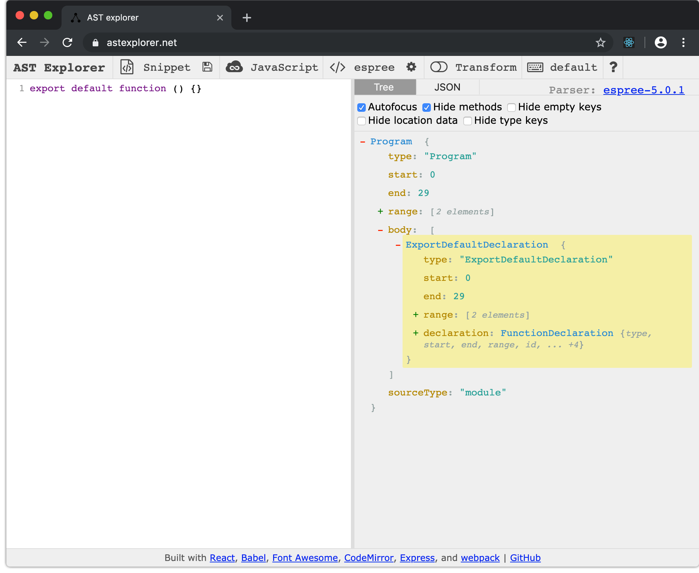
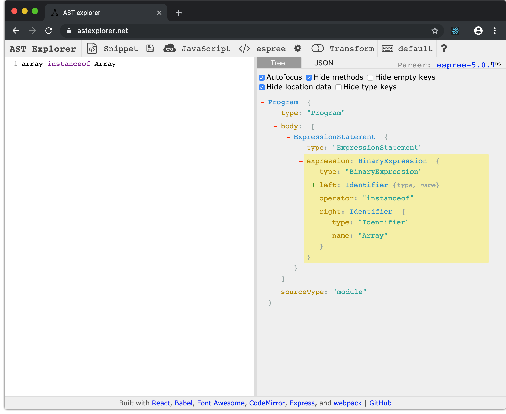
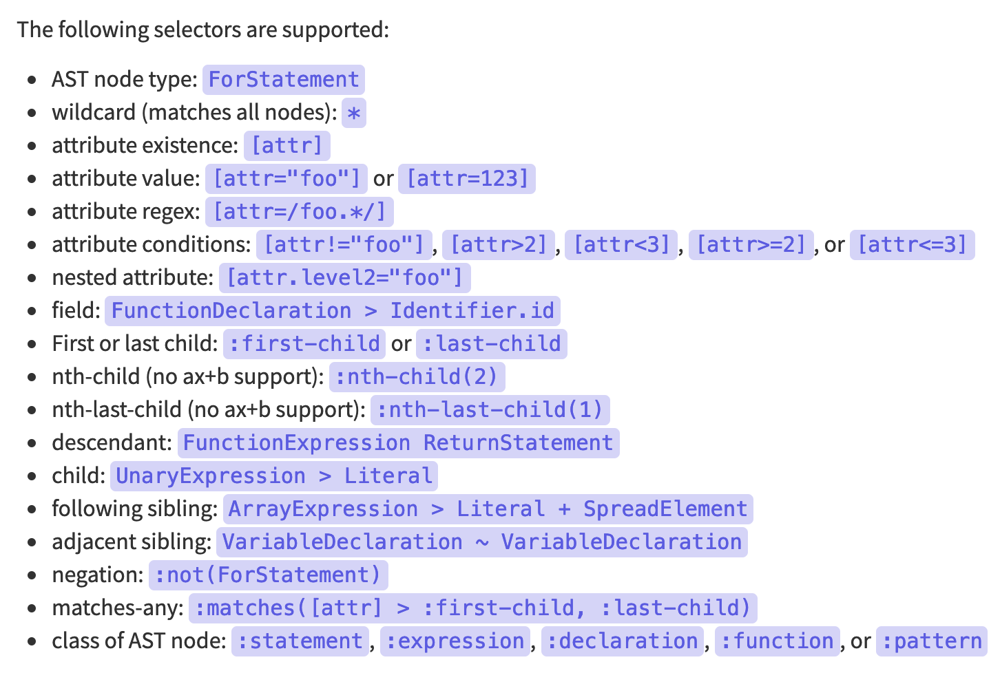

One of my favorite but lesser-documented features of ESLint is the usage of [selectors](https://eslint.org/docs/developer-guide/selectors). **In the same way you can query DOM elements on a web page with a CSS selector, you can query the nodes of an AST using [ESQuery](https://github.com/estools/esquery) selectors.**


The main ESLint rule to take advantage of this feature is [`no-restricted-syntax`](https://eslint.org/docs/rules/no-restricted-syntax), which allows you to define AST selectors that ESLint can report a violation (and optional message) when you use them. Here are a couple examples of how to use this rule and some considerations to make when or when not to use it.

### Example: Restrict a node type

For example, maybe you don't want to permit the usage of [default exports](https://developer.mozilla.org/en-US/docs/web/javascript/reference/statements/export#Using_the_default_export) in your codebase (like [the GitHub Desktop team decided](https://github.com/desktop/desktop/blob/0a06a201f2b21e6908ac307c937527aa1fe98d11/.eslintrc.yml#L75-L79)). You can disallow it with the `no-restricted-syntax` rule, but we'll first need to understand which node type we are looking for.

Luckily there is a tool called [AST Explorer][], which allows you to type in JavaScript code and view the resulting AST, as would be parsed by ESLint.



We can see that the `type` of this `export default function() {}` node is called `ExportDefaultDeclaration`, so telling the `no-restricted-syntax` rule to select that node type will disallow usage of that syntax. :thumbsup:

```yaml
rules:
  no-restricted-syntax:
    - error
    - selector: ExportDefaultDeclaration
      message: Default exports are disallowed. Prefer named exports.
```

### Example: Using selector attributes

Say you would like to warn against using `instanceof Array` and prefer using [`Array.isArray()`](https://developer.mozilla.org/en-US/docs/Web/JavaScript/Reference/Global_Objects/Array/isArray) instead. To figure out how this expression is defined in the AST, we can fire up the ever-helpful [AST Explorer](https://astexplorer.net/#/gist/e497c4e15c96f2306f835ca4b74e8bd8/48902b4b5019f82320352e00c43bebd1fa10ba2f) and type in the simplest snippet of code to produce that AST.



Looking at the highlighted AST result, there are three key pieces of information that can help us build an AST selector for the `no-restricted-syntax` rule:

- The node type that contains `instanceof` is called a `BinaryExpression`.
- The node has a property `operator` that has the value `instanceof`.
- The node has a property `right` that contains a property `name` with value `Array`.

Based on this information, we can build a selector with attributes like the one below to report when `instanceof Array` is used.

```yaml
rules:
  no-restricted-syntax:
    - error
    - selector: BinaryExpression[operator=instanceof][right.name=Array]
      message: `instanceof Array` is disallowed. Prefer `Array.isArray()`.
```

### Should I use `no-restricted-syntax` or write my own rule?

There are a couple of considerations to make when using `no-restricted-syntax`.

:thinking: **Can you represent the violation using an AST selector?** This is the first step of the process. Although you have access to many useful selectors, sometimes it will be easier to maintain an ESLint rule than a highly complex AST selector. Also, some static analysis requires handling a myriad of cases that may be impossible to write with a selector. Don't be afraid to type some examples into [AST Explorer][], and if you find patterns that can be represented by operators (like `=`) or regular expressions, you definitely have a chance to use the `no-restricted-syntax` rule over writing your own.



:thinking: **Do you want the ability to auto-fix a violation?** That is not supported by `no-restricted-syntax`, so you would need to write your own rule. However, sometimes trying to write ESLint fixers for syntax errors can sneakily introduce bugs unless you have thorough unit tests of your custom ESLint rules. If you don't mind manually changing `instanceof Array` to `Array.isArray()`, for example, then `no-restricted-syntax` is a simpler, quicker way to go.

In the end, there is no "right" answer. Experiment and see what works for you and your needs. My hope is that you've learned something new about ESLint, AST selectors, and the `no-restricted-syntax` rule.


[ast explorer]: https://astexplorer.net/
